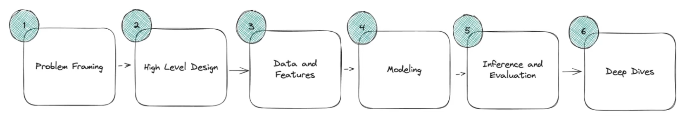

## Problem Statement

Design a bot detection system that can be used to detect bots on a social media platform, with the goal of seperating legitimate user activity from automated or malicious bot activity. 

### Questions to ask to understand the nature of the question

1. How common is bot activity?
   1. 50% of all activity is bots, 1% of that remains after simple heuristics
2. How does the data look like?
   1. Bots are evasive, inhuman behaviors
3. What is the scale of the problem
   1. 500 m daily average users
4. What do we do if we find these bots
   1. Ban the bots when we find them
5. What happens if we ban a Human user
   1. All ML has false positives
   2. Appeals are available for users, bots can navigate these appeals.
6. Do we have some sort of Labelled dataset
   1. Team of investigators who can look at accounts and determine if they are bots.
   2. .... inexact, takes a lot of time, and expensive

## Problem Description

Minimize ther impact of bot activity on legitimate users

## Diagrams

### High Level

### Initial Flow

### Data and Features

### Modelling (Part-1)

### Modelling (Part-2)

### Inference & Evaluation

