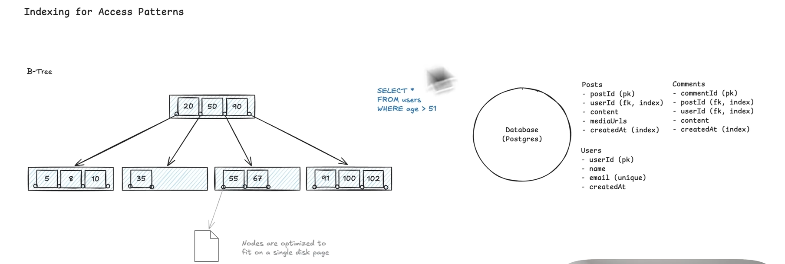

## Database Model Options

1. Relational Database
   
2. Document Databases
   
3. Key-value store
   
4. Wide-column store
   
5. Graph Database
   

## Schema Design

Three key factors:

1. Data volume - Where can data live? (single DB vs Distributed)
2. Access patterns - How is data queried (drives indexes & structure)
3. Consistency requirements - How strict? (ACID vs eventual consistency)

Summary

